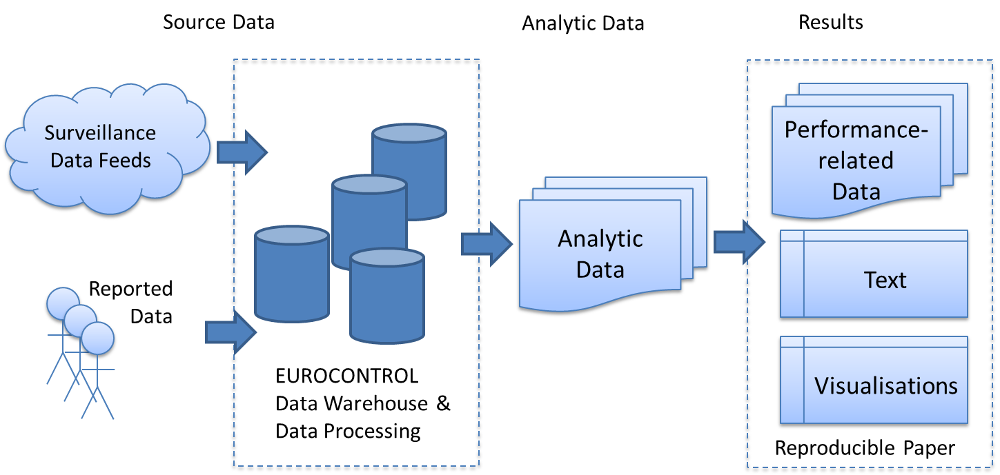
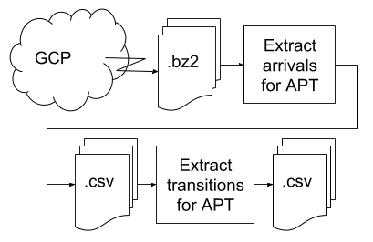

```{r global_options, include=FALSE}
library(png)
library(jpeg)
library(magick)

# library(png) library alread loaded
library(grid)
library(gridExtra)
library(dplyr)
library(readr)
library(tibble)
library(stringr)
library(ggplot2)

source(here::here("R/utils.R"))
source(here::here("R/asma.R"))   # check if functions need to go in other R file

knitr::opts_chunk$set(
  fig.env = 'figure',
  fig.pos = 'H',
  fig.align='center',
  out.width="100%",
  # eval = FALSE, # skip all code chunks unless explicitly "eval = TRUE"
  echo = FALSE, warning = FALSE, message = FALSE
)
```

<!-- Produced on `r format(Sys.time(), '%a %b %d %Y @  %X')`. -->

# Introduction

```{r}
#- teaser 
#- motivation
#- big picture
#- nature of the problem
```

Air transportation is undergoing a fundamental transformation. To meet the future growth of air traffic, political decision makers, strategic planers, practitioners and researchers aim to enhance the performance of air navigation services (ANS).
At the time being there is no consistent and regionally harmonised deployment programme. Typically, the deployment programmes are revolving around public-private partnerships and regional funding programmes resulting in a wide mix of consortia and stakeholder subsets.
The actual deployment of novel concepts or technological enablers is then driven by the programmes and to a lesser extent by operational network wide priorities following a piece meal approach. 

Moreover, the success of these deployments is typically supported by promising business cases and operational evaluations - often expressed as operational performance improvements. 
While these improvements are marketed, the underlying data and associated analyses in support of the results are seldomly made available. 
Explanations range from data sensitivity, commercial interests and property rights, through to complexity of the data analyses or simulations, and the associated volume of data.

Accordingly, ANS performance improvements are subject to a "credibility crisis" (varying levels of transparency) similar to reported problems in other domains, e.g. medicine [@kolata_2011], psychology [@ritchie_2012], ecology [@fraser_etal_2018]. Fidler and Wilcox (2018) provides a recent review of the reproducibility discussion [@fidler_wilcox_2018]. 
Part of the crisis sensation was driven by the diffusion of reported results as other researchers/analysts were able to discover substantial flaws in the data analyses. However, a crisis also offers room for self-correction.
Throughout the recent years, this lead to revisitng the concept of reproducible research.
This concept is based on the premises that an independent researcher/analyst is enabled to reproduce the reported results.
Reproducibility covers therefore a spectrum and mix of method, data, and analytical code/scripts per se openly available for scrutiny by others.

```{r}
#- High-level objective
#- Background of previous work.
```

Independent (operational) ANS performance builds on transparent and robust performance monitoring and reporting.
Within the European context, EUROCONTROL's Performance Review Unit (PRU) is committed to provide impartial analyses of the performance of the European Air Navigation System based on verified data.
With a view to enhance transparency, PRU is - inter alia - making performance-related data publicly available via its portal, [http://ansperformance.eu](http://ansperformance.eu), since early 2017 combined with the methodological documentation for the calculation of the performance indicators used under the EUROCONTROL Performance Revew System and the European Union Performance Scheme.
There has been recognition of using common and openly available tools and data in ATM research and operational validation.
With the advent of crowd sourced data and aviation databases there is an opportunity to advance the state of the art by combining open data and government organisation collected data to establish a curated platform supporting the quest for reproducibility in ANS Performance.
One of the associated building blocks is the performance reference trajectory [@spinielli_2018].
At the time of writing, the performance reference trajectory is in its design stage. The trajectory project builds on crowd sourced surveillance data fused with correlated position reports collected from European air navigation service providers.
Based on the Open Data model it will be possible to augment the data processing (e.g. data coverage, time synchronisation), establish derived data bases (e,g fleet data base), and derive associated performance models (e.g. aircraft performance model).
This setup enables the continual further development and validation of operational performance measures/indicators. 

```{r}
# Method by which the problem is approached.
```

This paper builds on the previous work and implements the reproducibility paradigm.
As a use-case example, a fully reproducible paper is devised assessing the performance in the arrival phase for 2 European airports. 
The underlying data, supporting data transformation and analysis, and the paper "source text" are made openly available at the paper companion web repository [https://github.com/euctrl-pru/reproducible-ans-performance-paper](https://github.com/euctrl-pru/reproducible-ans-performance-paper).
This enables the independent review and validation of the work reported.
Conceptually, an interested researcher/analyst can reproduce this paper by using the same toolset or validate the results by using the source data or interim data products if the complete reproduction of the study would be too time/resource consuming.

```{r}
#- Purpose and significance of the paper 
#- contribution of paper
```

The contributions of this paper are as follows:

* first fully reproducible ANS Performance related paper: The paper is written in RMarkdown allowing for the analysis of how text, code chunks, and visualisations are produced (including associated parameter settings) on the basis of the "source text".
* transparent data analyses and result generation through supporting web-page: All data used in this paper, intermediate data artifacts, and results including the associated transformation are publicly available for inspection, validation, or reproduction. 
* use-case analysis of ANS Performance during the arrival phase for 2 European airports: As an example the classical 'additional ASMA time' performance indicator is implemented on the basis of the provided data with showcasing trajectory derived capabilities to further study the efficiency of the arrival phase (e.g. impact of sequencing strategies [stack holdings, point merge]).

<!-- note: make sure that Section I does not significantly exceed first page -->

# Background - Reproducibility 

## Scope and Definition

Conceptually, reproducibility is not a new topic. 
It is as old as the scientific method and at the heart of the verification/validation of results.
The consistent and robust interpretation of results by independent researchers/analysts forms the evidence and the inherent body of knowledge in support of the applied methods or conclusions. 
This principle is also relevant for the further development on the basis of such results. 

The terms replication and reproducibility are often used interchangeably and there is a debate about the necessary and sufficient conditions for these terms. 
Results are considered replicable, "if there is sufficient information available for independent researchers to make the same [consistent] findings using the same procedures with new data" ([@gandrud_2015], p. 3f). 
Replicability, thus, does not aim to produce the "same" (aka identical) results. Here the goal is to establish confirmation of the approach and findings by deriving same conclusions. ^[For example, the same data collection procedures may not necessarily result in "identical" results as the time horizon might be different, (new or different) data for another study case show different result values, but the conclusions are consistent with the replicated approach.] 
<!-- this should be a footnote - caret ^ followed by [] --> 
Accordingly, results are reproducible, if an independent researcher can recreate the findings based on the given information. In our domain (i.e. operational ANS Performance and associated data analysis) this will require the access to data and derived summaries, how associated visualisations have been generated, the accompanying explanatory text, and conclusions drawn from the analysis.

Reproducibility has also to be seen in light of today's "publish or perish" context. It appears that higher emphasis is given to the frequency of publication than the validity of the produced results. Within the medical world cases like the Duke ovarian cancer scandal [@kolata_2011] are not single incidents, but also demonstrate how errors during the data analysis - in this case during the data preparation phase using spread sheets - can discredit the work.
Despite the increasing awareness, the adaption of reproducibility or moving to other open scholarship/investigation techniques is not yet achieved. 
This can be contrasted by emerging practices like data journalism. One interesting example is buzzFeed's article on the use of surveillance planes operated by law enforcement and military. The authors were able to demonstrate based on Open Data that these purposes range from tracking drug trafficking to testing new surveillance technology [@peteraldhous_2016]. The credibility of the article comes from the fact that all artifacts are made available to reproduce the findings or study the approach and data transformations leading to the conclusions of the article.

Arguably there are limits to the access to underlying source data. However, these limitations also offer an opportunity to address reproducibility [@koelle_open_2017]. For example, the data volume size might prohibit the further dissemination of data, its collection is too resource intensive, or there exists restrictive license agreements. Experience has shown that even in such cases, a limited sample of the source data can be made available for others to verify the initial data processing steps. 
For that purpose the creation of an analytical data set as the output of the data collection, gathering, and cleaning process stage can be understood as sufficient in the sense of reproducible research. 
One key transparency aspect is the documentation of the data preparation steps. 
The article Spies in the Skies by Peter Aldhous and Charles Seife [@peteraldhous_2016] is a good example for a reproducible analysis of the US government's airborne surveillance program. Though the license restrictions did not allow for the publication of the underlying aircraft position data, the authors made available the analytical data set and documented their analysis from the data preparation through to the publication stage.


Reproducibility is discussed in various domains. The following examples further promote the use of open source software and/or data:

* archaeology: Marwick et al. (2017) focusses on computational reproducibility in archaeological research by providing basic principles. The case study of their implementation uses open source software (R/Rmarkdown/git approach)  [@marwick_2017]. The paper advocates the publishing (analytical) data in support of the paper. This should not be an issue, even if there are constraints on the overall study data.
* engineering / signal processing: Vandewalle (2009) discuss the motivation and approach to reproducibility in signal processing (i.e. what, why, and how). Also here the case is made to open access to the code and data for validation purposes [@vandewalle_2009].
* operational ANS Performance monitoring: Spinielli et al. (2018) highlight the development and use of Open Flight Trajectories for reproducible ANS [@spinielli_2018].


## Practical Challanges


The reproducibility discussion focuses strongly on the recreation of results by other researchers/analysts.
A related problem is the re-generating of already completed (and potentially published) results with the - previously - available same input data. 
This is a fundamental issue that can be summarised as "can a future me re-do what I had done in the past"?
This problem space ranges across the complete data analysis life-cyle, including archiving the orignially used input data or the steps to generate the study data, documenting the data cleaning and transformation steps including the parameters chosen, etc.
By definition such a capability is a precondition for reproduction or replication by others. 
This implies that the analytical steps including the steps to produce summaries or estimates, visualisations, and associated conclusions are documented and archived. 
In order to enable others to recreate the own findings, such steps and documentation would need to be shareable.
This consideration has a strong bearing on the toolset chosen for this paper.

<!-- check if this can be merged with above -->
Some of the reasons why researchers/analysts do not publish data and computational procedures that allow reproduction will be hard to change [@daniel_nust_2018_2361304]. The predominant technical reasons have been listed above. However, there are also personal reasons such as the fear for floating ideas or loss of competitive advantage. Other reasons deal with more technical problems, e.g. lack of capabilities, procedures.

Another incentive for the adoption of an open and reproducible research practice can be seen in the wider recognition through increased citations, media attention, discussion with the community and collaborators, and ultimately funding opportunities.
The recent years have seen a strong use of research blogs and community platforms supporting the publication of smaller steps or intermediate results. The combination of web presentation and discussions offers a good basis for an initial dialogue.
Platforms like google scholar or researchgate.net offer additional features for outreach and communication.
This equally applies for paper archives such as arxiv.org for pre-prints.
Based on the credibility crisis discussion a number of journals are now promoting - or even requiring - the provision of analytical data in support of the paper publication. 
There is also an increasing number of requirements for national or European funded research with respect to data management and Open Data access to the research.

(ref:reproducible-research) Reproducible research, Fig. 2 in [@marwick_2017]. 

```{r reproducible-research,fig.cap='(ref:reproducible-research)',fig.pos='hbt',fig.height=4}
knitr::include_graphics("figures/reproducible-research-spectrum.png")
```


## Reproducibility Spectrum

Across the literature, researchers have identified a "reproducibility spectrum" ranging from the extreme, i.e. publication only (advertising and marketing of the done work), to almost or even fully replicable research.
The work of Marwick et al. [@marwick_2017] and Peng [@Peng1226] uses the analogy of a spectrum that can be mapped against the scoring of Vandewalle (2009) describing the level of reproducibility on a 0 to 5 scale [@marwick_2017].
In light of [@leek_2015], this paper conceptualises reproducibility as the "ability to recompute data analytic results given an observed dataset and knowledge of the data analysis pipeline" and accordingly "replicability of a study is the chance that an independent experiment targeting the same scientific question will produce a consistent result".

With Fig. \@ref(fig:reproducible-research) and the discussion in this section, this paper implements a fully reproducible workflow.
This is achieved by establishing this paper with open source software which allows to combine text, code, and visualisations.
The associated source text can also easily be read with a simple text editor/viewer. From that perspective, the text is fully inspectable.
This includes the majority of visualisations which are generated based on the data. Accordingly, the parameters and settings chosen can be validated by an independent researcher/analyst. Last but not least, the data for this paper is made available in conjunction with this text as Open Data. This also includes intermediate data artifacts which allows for the reproduction of the complete work or portions of it.
The conceptual approach and its building blocks will be presented in more detail in the next section.


# Method / Approach

## Conceptual Approach

(ref:concept-approach) Conceptual approach to reproducibility by PRU. 

```{r concept-approach,fig.cap='(ref:concept-approach)',fig.pos='hbt',fig.height=4}

```

This paper builds on the conceptual approach presented in Fig. \@ref(fig:concept-approach) to implement replicable data analyses for performance monitoring and associated research.
On the data level this approach abstracts three levels of data:

* source data
* analytical data
* results (and performance related data)

The source data for this paper comprises the PRU Performance Reference Trajectory and operator reported data under the airport operator data flow. This study also uses some aeronautical information for the use case airports accessible through AIP or community maintained open data archives (e.g. http://openaip.net, http://ourairports.com).
These data flows are processed and stored in the EUROCONTROL data warehouse.
The approach recognises that the full source data may or cannot be provided for a variety of reasons. 
These include volume of the source data sets, technical constraints allowing access to the source data storage, and data sharing policies or use limitations.
For the latter cases, PRU promotes the sharing of a so-called representative sample.
The idea is that with the provision of the associated processing code, other researchers/practitioners are able to reconstruct a part of the analytic data - and subsequently part of the reported results - on the basis of the provided source data set.

Analytical data refers to the data sets established based on the aforementioned processing code.
An essential defining characteristic of analytic data is that it is the data basis on which the reported results can be produced.
The abstraction between source data and analytic data allows for the sharing of such data as limitations are typically only appliable to the source data. We follow the notion of [@marwick_2017] by referring to the provision of a representative sample of 8 days accompanying this paper as source data.  

As depicted in Fig. \@ref(fig:reproducible-research) the provision of the data, code, and text allows to move to the right part of the reproducibility spectrum, away from marketing and final results to credible, transparent, and challengeable analysis.
Accordingly, the results (or performance related data) level presents the final abstraction.


## Toolset

This work builds on the RStudio tools for the R language [@rcoreteam_2018] including Git (and the web-based repository managers GitHub and GitLab) as underlying version control system.
The R language  was originally developed within the statistical community supporting the task of statistical reporting by providing routines for the statistical computing and visualisation.
Being open source, the R community is actively engaging and sharing related software packages to enhance the core functionality.
Without limiting the impact of other packages, the development of knitr [@R-knitr] and RMarkdown [@xie2018], ggplot [@wickham_2016] for visualisation, and the so-called tidyverse packages and RStudio IDE [@rstudioteam_2015] represent an open source ecosystem for data analysis.

A key feature for the implementation of the reproducibility paradigm is the fact that RMarkdown supports the combination of text, coding, and visualisations in a single document. 
The latter can be rendered into various output formats, e.g. classical paper report-styles (pdf, MS Word), html web-pages, and slides (both classical Powerpoint style or html-based presentations).
The fact that outputs can be rendered to html pages also supports the embedding of interactive graphics. This also facilitates the communication and outreach amongst researchers/analysts as standard web technology becomes a standard outlet format.
It follows that changes to the code (and associated visualisations) or text can be readily updated by re-rendering the adapted report. 
This allows to develop standard templates for recurring reports based on varying input data, but it also serves the iterative development of larger reports (and studies).


A minimal example of an RMarkdown document, a plain-text file with the conventional
extension `.Rmd` is shown below:

\footnotesize

```{r include=FALSE}
b = '`r b[1]`'  # an ugly hack; don't look at me
```
```yaml
---
title: "R Markdown example"
author: "John Doe"
date: "2019-02-17"
output: html_document
---
```
````markdown
Some math 
$\frac{1}{N} \sum_{i=1}^N (x_i -\mu)^2$,
followed by numbered list:
  
1. *italics* and **bold** text
1. then bullets
    - simple, eh?

and a code chunk:

`r ''````{r}
library(ggplot2)
fit = lm(mpg ~ wt, data = mtcars)
b   = coef(fit)
ggplot(mtcars, aes(x = wt, y = mpg)) +
  geom_point() + 
  geom_smooth(method = lm, se = TRUE)
```

The slope of the regression is `r b[1]`.
```
````


\normalsize


There are three components of an R Markdown document: the metadata, the text and the code.
The metadata, written between the pair of three dashes `---`, helps in the production of
output document (title, type of document [web page, PDF, MS Word], ...)
The text, which follows the metadata, is witten using Markdown, a simplified formatting syntax
which can include prose and code.
There are two types of (computer) code:

- A code chunk starts with three backticks and `r` indicates the
  language name,^[R Markdown supports 50 other languages.] and ends with
  three backticks.

- An inline R code expression starts with backtick r and ends with a backtick.

Code portions are executed when the document is rendered.
Fig. \@ref(fig:rmd-example) shows how the simple R Markdown example is rendered.

(ref:rmd-example) The output of a minimalist example of RMarkdown. 

```{r rmd-example,echo=FALSE,fig.cap='(ref:rmd-example)',fig.pos='htb',fig.height=3}
knitr::include_graphics('figures/rmd-example.png', dpi = NA)
```


A particular strong point is that the R/RStudio ecosystem is open source software.
This includes also its extensibility with other packages. There exists a wide variety of packages for data analytical tasks and techniques. This mechanism can also be useful for the communication of results. Researchers/analysts are able to provide their code and supporting documentation as a package for other researchers to build on.
For example, throughout the last year, PRU has developed certain utility functions for reoccurring tasks of the data analytical pipeline.
It is now planned to wrap these functions into a package saving other researchers/analysts of recoding certain steps.
For this paper, the functions and data transformations are reported as part of the RMarkdown and supporting R files.
All these files are available via the project webpage.


## Capabilities: Performance Reference Trajectory

Throughout the recent year PRU developed the data analytical capabilities to fuse correlated position reports and ADSB surveillance data.
This work has been reported in [@koelle_open_2017] and [@spinielli_2018]. The idea is to establish a pan-European air situation picture openly available to research and practitioners.
Conceptually, the fused performance reference trajectory will be a key milestone in combatting the "marketing myths."
For example, operational improvements can be directly assessed by interested analysts as access to the Open Data enables the validation of the observable performance improvements. This allows for the application of commonly accepted methods and models to express performance benefits and  - ultimately - challenge related publications on deployments and achieved improvements.

At the end of 2018 the initial development project phase was closed and PRU is now investigating options for deploying and maintaining the processing modules on a cloud platform.
The goal is to establish and operate the underlying data processing capabilities throughout 2019 and launch the regular provision of the performance reference trajectory as Open Data in 2020.
It is also planned to establish a network and complement the air situation picture by deploying additional sensors or determining non-ADSB derived positions as a community effort.
As a mid-term goal associated data bases and models for performance shall be established and jointly maintained.


<!-- not word by word - but the info is contained elsewhere 
## Application Use Cases: ASMA, Point Merge, holdings 

This paper revolves around advancing the state of the art by demonstrating the implementation of the reproducibility paradigm.
Accordingly, this paper builds on the concepts behind Fig. \@ref(fig:reproducible-research) and Fig. \@ref(fig:concept-approach).
This includes providing the data, code, and results.
All of this is version controlled and archived on <<LINK TO ARCHIVE OR WEB PAGE>>.

The approach and processing pipeline described in this paper builds on several data sets.
...

As a practical application use case, this paper replicates the additional ASMA time algorithm.
... describe AMSA here ... which data sets used ... how compared ... point to next section for details of this.

In a second step, the ASMA principle is moved to a distance based measure.
... describe what will be done ... how does this link to what we want to achieve ... point to next section for more details.

As examples for further developments based on the aforementioned capabilities, this paper presents a closer look at arrival flow management strategies. 

-->

# Results

## Data Preparation

(ref:data-preparation-pipeline) Data preparation pipeline. 

```{r data-preparation-pipeline,fig.cap='(ref:data-preparation-pipeline)',fig.pos='htb',fig.height=4}

```

The raw data sources for the use cases of this paper have been processed by a pipeline of R scripts.
For example, the additional ASMA time indicator and the anticipated further breakdown of the arrival phase can be described by a set of tranistion points: 

* segment I: entry into the ASMA area to entry into the holding/vectoring segment
* segment II: holding/vectoring segment; for the use case reported holding stacks or point merge procedure
* segment III: final approach alignment and approach

Figure \@ref(fig:data-preparation-pipeline) shows how the transition points 
(40 NM, entry/exit from holding/point-merge area, landing) for the use case airports
have been extracted.
Due to the size of the daily reference trajectory files, the pipeline operates
on one date at the time.
Assuming the relevant RT flight and position files are downloaded
from GCP as described in [@performancereviewunit_2019],
the steps and the relevant scripts (available in the companion repository for this paper) used are:

1. the script `R/extract-arrivals.R` extracts arrivals to the `APT` airport and generates:

    * a file with flight details
    * a file with all the arrivals' positions (`raw` trajectories)
    * a file with all the arrivals' positions (smoothed trajectories)
    * a file with all (smoothed) arrivals' positions within 40 NM of the airport's reference position (ARP)

3. the script `R/extract-transition-points.R` extracts transition points in the terminal area
   and generates a file containing per each flight:
   
    * the first point within 40 NM, `P40`
    * the first and last point within the holding/point-merge area, `PHOLD`
    * an estimated landing point, `PLAND`

(ref:eidw-arrival-chart-east) Excerpt of Irish AIP showing point merge arc layout East of Dublin Airport. 

```{r eidw-arrival-chart-east,fig.cap='(ref:eidw-arrival-chart-east)',fig.pos='hbt',fig.height=4}

```

  
  This stage makes use of data extracted/extrapolated from the relevant AIP, see
  for example Fig. \@ref(fig:eidw-arrival-chart-east), such
  as ARP, runway name and threshold position/elevation, polygons for holding
  stacks or point-merge areas. Specifically the polygons have been heuristically defined from the
  point merge points in the AIP and enlarged by 2NM in order to cater for the spread of real flown
  trajectories,
  see the scripts `R/egll-data.R` and `R/eidw-data.R`.


Each transition position mentioned above consist of at least

* aircraft/flight info (ID, callsign, registration, ADEP/ADES, ICAO 24 bit address)
* 4D position (timestamp $T$, longitude, latitude, altitude)
* flown distance $D$ from aerodrome of departure (ADEP)
* sequence number
* point info (sequence number, type of transition point [`P40`, `PHOLD`, `PLAND`])
* distance from ARP

These allow to calculate for each flight

* the time spent before the holding/point-merge area, $T_{PHOLD|first} - T_{P40}$
* the distance flown before the holding/point-merge area,
  $D_{PHOLD | first} - D_{P40}$
* the time spent within the holding/point-merge area, $T_{PHOLD | last} - T_{PHOLD|first}$
* the distance flown within the holding/point-merge area,
  $D_{PHOLD | last} - D_{PHOLD | first}$
* the time spent out of the holding/point-merge area till landing,
  $T_{PLAND} - T_{PHOLD | last}$
* the distance flown out of the holding/point-merge area till landing,
  $D_{PLAND} - D_{PHOLD | last}$


## Data Coverage

The previous sections described the data preparatory action.
For this paper, a reproducible data set for the analysis of arrival management techniques at London Heathrow and Dublin airport have been extracted. 
The data set comprises flights for the period of 1.-8. August 2017.
It can be inferred from the traffic mix at London Heathrow (major international hub) that only a limited subset of flights is not equipped with ADSB, while a slightly higher level of non-equipped flights is expected at Dublin (higher share of intra-European flights).

```{r, warning=FALSE}
# load data sets
egll_arrs_apdf <- read_arrs_apdf("egll", .path = "./data/")
egll_arrs_trj  <- read_flts_trj( "egll", .path = "./data/")

eidw_arrs_apdf <- read_arrs_apdf("eidw", .path = "./data/")
eidw_arrs_trj  <- read_flts_trj( "eidw", .path = "./data/")

# prepare coverage data set
egll_cov_apdf <- egll_arrs_apdf %>% prep_cov_apdf()
egll_cov_trj  <- egll_arrs_trj %>% prep_cov_trj()

eidw_cov_apdf <- eidw_arrs_apdf %>% prep_cov_apdf()
eidw_cov_trj  <- eidw_arrs_trj %>% prep_cov_trj()
```

(ref:coverage-egll) Number of arrivals in data sets, i.e. 1.-8. Aug 2017.

```{r coverage-egll, fig.cap='(ref:coverage-egll)',fig.pos='hbt',fig.height=4}
tmp <- bind_rows(eidw_cov_apdf, eidw_cov_trj, egll_cov_apdf, egll_cov_trj) %>%
         trim_time_horizon %>% na.omit

ggplot(data = tmp
       ,mapping = aes(x = factor(DOF), fill = SOURCE)
       ) +
  geom_bar(position = "dodge") + 
  theme_bw() +
  facet_wrap(. ~ ADES) +
  theme(
    #legend.position = "bottom"
    legend.position = c(1, 0.65), legend.justification = c(1, 0)
    , axis.text.x = element_text(angle = 45, hjust = 0.5, vjust = 0.5)
    ) +
  labs(x = "date of flight"
       ,fill = "data source") 
```

Fig. \@ref(fig:coverage-egll) shows the overlap of the data between the arrivals extracted from the airport operator data flow (APDF) and the reference trajectory (RTRJ) for London Heathrow (EGLL) and Dublin (EIDW).

```{r}
cov_tbl <- tmp %>% group_by(ADES, SOURCE, DOF) %>%
  summarise(N_ARR = n()) %>%
  tidyr::spread(SOURCE, N_ARR) %>%
  mutate(COV = 1 - (APDF - RTRJ)/APDF)

cov_perc <- cov_tbl %>% summarise(avg = mean(COV))
```

For the time horizon of this paper, the coverage of the reference trajectory derived data is for Heathrow (EGLL) `r round(cov_perc$avg[cov_perc$ADES == "EGLL"], 2) * 100`% and for Dublin `r round(cov_perc$avg[cov_perc$ADES == "EIDW"], 2) * 100`%.


## "replicate" ASMA (time-based)

The additional time in the arrival sequencing and metering area (ASMA) is a globally recognised measure to assess flight efficiency during the arrival phase. 
The ASMA metric calculates the additional time based on a reference time which is determined for a family of flights sharing similar characteristics. 
For each flight $i$ the additional ASMA time is

$${add.~ASMA~time}_i = {actual~travel~time}_i - {reference~time}_i$$

The reference time $i$ is determined for flights with similar arrival characteristics (c.f. [http://ansperformance.eu/references/definition/additional_asma_time.html](http://ansperformance.eu/references/definition/additional_asma_time.html)). These include 1.) the arrival entry sector at 40NM from the airport, 2.) the aircraft weigth turbulence category and engine type, and 3.) the actual landing runway.
The reference times are built for a longer time horizon and extracted from the PRU data base as additional source data.

(ref:ASMA-travel-egll) Distribution of actual ASMA travel times for EGLL (1.-8. Aug 2017).


```{r ASMA-travel-egll,fig.cap='(ref:ASMA-travel-egll)',fig.pos='hbt',fig.height=4, message=FALSE}
ac_typ_wtc_eng <- read_csv2(
  "data/ACTYPE_WTC_JetTurbo_V3.csv"
  , col_types = cols_only(
    "Aircraft type" = col_character()
    ,"WTC"          = col_character()
    ,"Turboprop"    = col_character()
    ,"ENGINE_TYPE"  = col_character()
  )
  ) %>% mutate(
    WTC2 = paste(WTC, ENGINE_TYPE, sep = "")
    ,WTC2 = ifelse(WTC2 == "HJ", "H", WTC2)
    ) %>% rename("TYP" = "Aircraft type")

# heuristic runway allocation
egll_rwy <- data.frame(RWY_BRG = c("(0,58]","(58,180]","(180,280]","(280,360]")
                       ,RWY    = c( "09R"  ,  "09L"   ,  "27R"    ,  "27L")
                     )  # c.f. analysis heuristic "colouring"

egll_asma_ref <- read_csv("data/ASMA_REF.csv") %>%
  filter(AIRPORT == "EGLL", ASMA_RADIUS == 40) %>%
  mutate(SECTOR = paste("(", FROM_BEARING,",", TO_BEARING, "]", sep = "")) %>%
  filter(!is.na(UNIMPEDED_TIME))

sects <- egll_asma_ref %>% pull(TO_BEARING) %>% unique %>% union(c(0,360)) %>% sort 
  
asma_pts <- function(apt) {
  ds <- read_pts_trj(apt) %>%
    filter(type %in% c("P40", "PLAND")) %>% group_by(flight_id) %>% 
    ## might be better to split in P40 and PLAND and merge both sets & rename vars
    arrange(flight_id) %>% 
    mutate(TYP = unique(aircraft_type)
           , C40_TIME = min(timestamp) , C40_BRG  = ifelse(type == "P40",bearing,NA)
        #   , C40_DIST_FLOWN = ifelse(type == "P40", distance_flown, NA)
           , GATE_TIME = max(timestamp), GATE_BRG = ifelse(type == "PLAND",bearing,NA)
        #   , GATE_DIST_FLOWN = ifelse(type == "PLAND", distance_flown, NA)
           ) %>% 
    mutate(GATE_BRG = lead(GATE_BRG)) %>%
    ## bearings are not in QDR, but QDM (or true equivalent :) )
    mutate(C40_BRG = ifelse(bearing < 180, C40_BRG + 180, C40_BRG - 180)) %>%
    select(flight_id, TYP, C40_TIME, C40_BRG   #, C40_DIST_FLOWN
           ,GATE_TIME, GATE_BRG                #, GATE_DIST_FLOWN 
           ) %>%
    na.omit %>% ungroup() %>%
    mutate(TRAVEL = difftime(GATE_TIME, C40_TIME, units = "min" ))
  return(ds)
}

# add runway info
egll_pts <- asma_pts("egll") %>% mutate(RWY_BRG = cut(GATE_BRG, breaks = c(0,58, 180, 280, 360)))
egll_pts <- egll_pts %>% left_join(egll_rwy)

# add C40 info
egll_pts <- egll_pts %>% mutate(C40_SECT = cut(C40_BRG, breaks = sects)) 

# add aircraft wtc & engine
egll_pts <- egll_pts %>% left_join(ac_typ_wtc_eng %>% select(TYP, WTC2)) 
egll_asma_ref <- egll_asma_ref %>% select(WTC2 = AC_CLASS, RWY = RUNWAY , C40_SECT = SECTOR, REF_TIME = UNIMPEDED_TIME)

egll_pts <- egll_pts %>% left_join(egll_asma_ref) 

# remove outlier
tmp <- egll_pts %>% filter(TRAVEL > 8, TRAVEL <=100)

ggplot(data = tmp, mapping = aes(x = C40_SECT, y = TRAVEL)) +
  geom_boxplot() +
  theme_bw() +
  ylim(0,100) +
  labs(x = "ASMA entry radials", y = "travel time [min]")
```

As an example, the distribution of the actual arrival transit times for arrivals into Heathrow (EGLL) are shown in Fig. \@ref(fig:ASMA-travel-egll). Heathrow operates holding stacks to tactically optimise the arrival throughput.
Dependent on the traffic situation, aircraft may experience longer holding times (i.e. long tails of boxplots in Fig. \@ref(fig:ASMA-travel-egll)).

```{r}
# heuristic runway allocation
eidw_rwy <- data.frame(RWY_BRG = c("(0,160]","(160,210]","(210,260]","(260,360]")
                       ,RWY    = c( "10"  ,  "16"   ,  "34"    ,  "28")
                     )  # c.f. analysis heuristic "colouring"

eidw_asma_ref <- read_csv("data/ASMA_REF.csv") %>%
  filter(AIRPORT == "EIDW", ASMA_RADIUS == 40) %>%
  mutate(SECTOR = paste("(", FROM_BEARING,",", TO_BEARING, "]", sep = "")) %>%
  filter(!is.na(UNIMPEDED_TIME))

sects <- eidw_asma_ref %>% pull(TO_BEARING) %>% unique %>% union(c(0,360)) %>% sort 

# add runway info
eidw_pts <- asma_pts("eidw") %>% 
  mutate(RWY_BRG = cut(GATE_BRG, breaks = c(0, 160, 210, 260, 360))) %>%
  left_join(eidw_rwy)

# add C40 info
eidw_pts <- eidw_pts %>% mutate(C40_SECT = cut(C40_BRG, breaks = sects)) 

# add aircraft wtc & engine
eidw_pts <- eidw_pts %>% left_join(ac_typ_wtc_eng %>% select(TYP, WTC2)) 
eidw_asma_ref <- eidw_asma_ref %>% select(WTC2 = AC_CLASS, RWY = RUNWAY , C40_SECT = SECTOR, REF_TIME = UNIMPEDED_TIME)

eidw_pts <- eidw_pts %>% left_join(eidw_asma_ref) 
```


```{r}
calc_avg_asma <- function(ds){
  ds <- ds %>% mutate(ADD_TIME = as.double(TRAVEL) - REF_TIME) %>%
    summarise(  N_ARRS   = sum(!is.na(REF_TIME))
              , ADD_TIME = sum(ADD_TIME, na.rm = TRUE)
              , AVG_ADD_TIME = ADD_TIME / N_ARRS
              )
}

calc_avg_asma_20 <- function(ds){
  refs <- ds %>% group_by(TYP, RWY, WTC2) %>%
    summarise(REF_TIME_20 = quantile(TRAVEL, probs = 0.2, na.rm = TRUE))
  
  ds <- ds %>% left_join(refs, by = c("TYP", "RWY", "WTC2")) %>%
    mutate(ADD_TIME = TRAVEL - REF_TIME_20) %>%
    summarise( N_ARRS      = sum(!is.na(REF_TIME_20))
              ,ADD_TIME    = sum(ADD_TIME, na.rm = TRUE)
              ,AVG_ADD_TIME = ADD_TIME / N_ARRS
              )
}

egll_asma <- egll_pts %>% calc_avg_asma() %>% mutate(AIRPORT = "EGLL", MEASURE = "TRJ-REF")
eidw_asma <- eidw_pts %>% calc_avg_asma() %>% mutate(AIRPORT = "EIDW", MEASURE = "TRJ-REF")

egll_asma2<- egll_pts %>% calc_avg_asma_20() %>% mutate(AIRPORT = "EGLL", MEASURE = "TRJ-20PCT")
eidw_asma2<- eidw_pts %>% calc_avg_asma_20() %>% mutate(AIRPORT = "EIDW", MEASURE = "TRJ-20PCT")

```

Fig. \@ref(fig:ASMA-compare) compares the additional ASMA time extracted from the PRU performance dashboard, the trajectory based calculation with the dashboard derived reference time, and a 20th percentile approach purely based on the trajectory data.

<!-- TODO: download and extract ASMA from ansperformance.eu, possibly trajectory 20th percentile -->
<!--
```
if(!file.exists("data/ASMA_PERF.xlsm")){
  message("Download ASMA from ansperformance.eu")
  download.file(url = "http://ansperformance.eu/data/set/asma/ASMA_Additional_Time.xlsm"
                ,destfile = "data/ASMA_PERF.xlsm")
}
    asma_perfeu <- readxl::read_excel("data/ASMA_PERF.xlsm", sheet = "DATA") %>%
      filter(YEAR == 2017, APT_ICAO %in% c("EGLL", "EIDW", "LSZH"), MONTH_NUM == 7)
    
    asma_perfeu <- select(N_ARRS = FLT_ASMA_UNIMP_2
                          ,ADD_TIME = TIME_ASMA_ADD_2
                          ,AVG_ADD_TIME = ADD_TIME / N_ARRS
                          ,AIRPORT = APT_ICAO
                          ,MEASURE = "APDFNM")
```
WORKED ONCE SINCE THEN ERROR: Error: Evaluation error: error -103 with zipfile in unzGetCurrentFileInfo
==> downloaded xlsm and saved out data tab to ASMA.PERF.csv
-->

(ref:ASMA-compare) Comparison of determined ASMA values, i.e. 1.-8. Aug 2017.


```{r ASMA-compare, fig.cap='(ref:ASMA-compare)',fig.pos='hbt',fig.height=4}
asma_perfeu <- readr::read_csv2("data/ASMA_PERF.csv") %>%
  dplyr::filter(YEAR == 2017, APT_ICAO %in% c("EGLL", "EIDW"), MONTH_NUM == 7) %>%
  dplyr::rename(N_ARRS = FLT_ASMA_UNIMP_2, ADD_TIME = TIME_ASMA_ADD_2, AIRPORT = APT_ICAO) %>%
  dplyr::mutate(AVG_ADD_TIME = ADD_TIME / N_ARRS ,MEASURE = "APDFNM")

asma_perfeu <- asma_perfeu %>% 
  dplyr::select(N_ARRS, ADD_TIME, AVG_ADD_TIME, AIRPORT, MEASURE)


tmp <- bind_rows( egll_asma, egll_asma2
                 ,eidw_asma, eidw_asma2
                 ,asma_perfeu)

ggplot(data = tmp, mapping = aes(x = AIRPORT, y = AVG_ADD_TIME
                                 , fill = MEASURE)
                                 )  +
  geom_col(width = 0.7, position = position_dodge(width = 0.8)) +
  theme_bw() +
  labs(x = "airport", y = "average additional ASMA time [min./arrival]") +
  scale_fill_discrete(name = "variant", breaks = c("APDFNM", "TRJ-REF", "TRJ-20PCT"))
```

In Fig. \@ref(fig:ASMA-compare) 
APDFNM refers to the variant used for the EUROCONTROL Performance Review System. The reference time is build on the basis of a one-year sample. Applying this reference time to the trajectory based travel times (i.e. TRJ-REF), there is a strong increase of the additional ASMA time for Heathrow (EGLL), while in the case of Dublin (EIDW) a reasonable decrease takes place. Calculating the additional ASMA time exclusively with the trajectory sample and applying a 20th percentile approach (TRJ-20PCT), shows a significant drop in EGLL and a moderate increase at Dublin. The high variation for Heathrow shows that the additional ASMA time is strongly dependent on the time horizon.
The pure trajectory based measure - by definition - includes the effect of the operational concept (stack holdings) and distorts the measure. In the case of Dublin it can be argued that the TRJ-20PCT measure reflects the time based ASMA measure suffiently.

## Distance-based ASMA

conceptually, measuring flight inefficiency in terms of flight time accounts for the airspace user perspective.
The previous section has also shown the high dependency of the time based measure on the sample size or reference time attribution.
Flight time is linked to engine time and accordingly, assuming maneuvering for operational separation and sequencing reasons, fuel burn.
From a service provision perspective, efficiency relates to the capability to provide the least distance flown within the ASMA area.
In that respect, the data analytical capability to determine an associated additional distance flown metric addresses an open gap.

(ref:ASMA-time-dist) Relationship travel time and distance flown, i.e. 1.-8. Aug 2017.

```{r ASMA-time-dist, fig.cap='(ref:ASMA-time-dist)', message = FALSE}
prep_asma_dist <- function(apt) {
   ds <- read_pts_trj(apt) %>%
    group_by(flight_id) %>% arrange(flight_id, sequence_number) %>% 
    summarise(N = n(), DIST_FLOWN = (max(distance_flown) - min(distance_flown))
              , TRAVEL = difftime(max(timestamp), min(timestamp), units = "min")
              , TYP = unique(aircraft_type) 
              ) 
   return(ds)
} 

egll_dist <- prep_asma_dist("egll")
eidw_dist <- prep_asma_dist("eidw")

ggplot(data = egll_dist %>% filter(TRAVEL > 6), mapping = aes(x = DIST_FLOWN, y = TRAVEL)) +
  geom_point() + 
  theme_bw() +
  ylim(0,75) +
  labs(x = "distance flown from entry 40NM to touchdown [NM]", y = "time flown from 40NM entry to touchdown")
```

Fig. \@ref(fig:ASMA-time-dist) shows the relationship between the actual distance flown and the actual time flown.
The variation of travel times is influenced by varying airspeeds or weather phenomena (e.g. wind).
This paper applies a simple 15-th percentile approach to the distance flown per arrival sector, aircraft type/engine, and landing runway.

```{r tbl-asma-dist}
asma_dist <- function(ds_pts, ds_dist){
  ds <- ds_pts %>% select(flight_id, RWY, C40_SECT, WTC2)
  ds <- ds %>% left_join(ds_dist)
  
  refs <- ds %>% group_by(RWY, C40_SECT, WTC2) %>% 
    summarise(REF_DIST = quantile(DIST_FLOWN, probs = 0.15)
              ,N_SAMPLE = n())
  
  ds <- ds %>% left_join(refs, by = c("RWY","C40_SECT","WTC2")) 
  ds <- ds %>% mutate(ADD_DIST = DIST_FLOWN - REF_DIST) %>%
    summarise(TOT_ADD_DIST = sum(ADD_DIST, na.rm = TRUE)
              ,N_ARRS  = sum(!is.na(ADD_DIST))
              ,AVG_ADD_DIST = TOT_ADD_DIST / N_ARRS)
  return(ds)
}

egll_asma_dist <- asma_dist(egll_pts, egll_dist) %>% mutate(AIRPORT = "EGLL")
eidw_asma_dist <- asma_dist(eidw_pts, eidw_dist) %>% mutate(AIRPORT = "EIDW")

dist_asma <- bind_rows(egll_asma_dist, eidw_asma_dist) %>%
  select(AIRPORT, TOT_ADD_DIST, N_ARRS, AVG_ADD_DIST)

knitr::kable(dist_asma, digits = 2
             ,caption = "Average additional distance flown (15th pct)")
```

Tab. \@ref(tab:tbl-asma-dist) lists the determined average additional distance at the study airports.
The total additional distance is determined as the aggregated sum of the differences in each segmnent
with 15-th percentile reference distance.


## Arrival Management Practices

For an initial drill down, this paper uses arrival practices at London Heathrow and Dublin.
The approach to managing the arrival flow differs significantly between both airports.
Conceptually, London Heathrow employs the "pressure on the runway" concept with a focus on achieving and balancing a continuously high level of runway throughput utilisation. 
This is achieved by controlling the demand through 4 arrival stacks that allow for the tactical sequencing on the last portion of the approach.
Dublin is one of the airports that pioneered the implementation of "point merge".
Point merge aims at replacing circular holdings by longitudal holdings to establish the sequence based on predefined legs. 
<!-- ADD A FEW MORE WORDS ON THE CONCEPTS IF NEEDED -->

From a performance perspective it is therefore interesting to identify and measure the impact of the operational concept on the overall flight efficiency during the arrival phase of flight.

```{r, message=FALSE}
asma_dist2 <- function(ds_pts, ds_dist){
  ds <- ds_pts %>% select(flight_id, RWY, C40_SECT, WTC2)
  ds <- ds %>% left_join(ds_dist)
  
  refs <- ds %>% group_by(RWY, C40_SECT, WTC2) %>% 
    summarise(REF_DIST = quantile(DIST_FLOWN, probs = 0.15)
              ,N_SAMPLE = n())
  
  ds <- ds %>% left_join(refs, by = c("RWY","C40_SECT","WTC2")) 
  ds <- ds %>% mutate(ADD_DIST = DIST_FLOWN - REF_DIST)
  return(ds)
}

egll_long_dist <- asma_dist2(egll_pts, egll_dist) %>% 
  filter(TRAVEL > 5) %>%    # remove outlier
  arrange(desc(ADD_DIST))
egll_day1 <- readr::read_csv("data/egll_pos_rt_40NM_2017-08-01.csv")

egll_long_dist <- egll_long_dist %>% mutate(IS_DAY1 = ifelse(flight_id %in% egll_day1$flight_id, 1, 0)) %>%
  filter(IS_DAY1 == 1) %>% head(3)
egll_day1 <- egll_day1 %>% filter(flight_id %in% egll_long_dist$flight_id)

source(here::here("R/plot-egll-tma.R"))
```

(ref:egll-trajectory-example) EGLL - long trajectory flown on 1. Aug 2017.

```{r egll-trajectory-example, fig.cap='(ref:egll-trajectory-example)'}
plot_egll_tma() + geom_point(
  data = egll_day1 %>% select(flight_id, latitude, longitude)
  , mapping = aes(x = longitude, y = latitude, colour = flight_id)
  ) +
  theme_bw() +
  theme(legend.position = "none")
```

(ref:eidw-trajectory-example) EIDW - long trajectory flown on 1. Aug 2017.


```{r eidw-trajectory-example, fig.cap='(ref:eidw-trajectory-example)'}
eidw_long_dist <- asma_dist2(eidw_pts, eidw_dist) %>% 
  filter(TRAVEL > 5) %>%    # remove outlier
  arrange(desc(ADD_DIST))
eidw_day1 <- readr::read_csv("data/eidw_pos_rt_40NM_2017-08-01.csv")

eidw_long_dist <- eidw_long_dist %>% mutate(IS_DAY1 = ifelse(flight_id %in% eidw_day1$flight_id, 1, 0)) %>%
  filter(IS_DAY1 == 1) %>% filter(ADD_DIST < 50) %>% 
  filter(flight_id %in% c(
    "80788782-6fa7-42f5-b636-b5eee6822aab"
    ,"bbef0049-6748-49dc-ada3-8d058a7a03a6"
  #  ,"8df967dd-6880-4fda-86c3-a573a32abb19"
    ,"2db1b8a1-28ce-4dbf-9115-7404940bc832"
  ,"4d3496e0-06ef-4601-9339-1bc2367fe18f"
  ))
eidw_day1 <- eidw_day1 %>% filter(flight_id %in% eidw_long_dist$flight_id)

source(here::here("R/plot-eidw-tma.R"))

plot_eidw_tma() + geom_point(
  data = eidw_day1 %>% select(flight_id, latitude, longitude)
  , mapping = aes(x = longitude, y = latitude, colour = flight_id)
  ) +
  theme_bw() +
  theme(legend.position = "none")
```

Fig. \@ref(fig:egll-trajectory-example) and Fig. \@ref(fig:eidw-trajectory-example) show examples
for long distances flown on 1. Aug 2017.
The trajectory data allows for the identification of the holdings and/or sequencing area.
This allows to separate the effect of the operational concepts.

(ref:distance-flown-segment) Actual distances flown for each segment of the arrival phase (i.e. EGLL, 1.-8. Aug 2017).

<!-- TO DO: clean figure - work out bearings -- do it for Dublin as well -->


```{r distance-flown-segment, fig.cap="(ref:distance-flown-segment)"}
segment_approach <- function(ds) {
  ds <- ds %>% group_by(flight_id) %>% arrange(flight_id, timestamp)
  
  c40s <- ds %>% filter(type == "P40") %>% 
    select(flight_id, C40_TIME = timestamp, C40_BRG = bearing, C40_DIST_FLOWN = distance_flown)
  hins <- ds %>% filter(type == "PHOLD") %>% filter(timestamp == min(timestamp)) %>% 
    select(flight_id, HIN_TIME = timestamp, HIN_BRG = bearing, HIN_DIST_FLOWN = distance_flown)
  houts<- ds %>% filter(type == "PHOLD") %>% filter(timestamp == max(timestamp)) %>%
    select(flight_id, HOUT_TIME = timestamp, HOUT_BRG = bearing, HOUT_DIST_FLOWN = distance_flown)
  gates<- ds %>% filter(type == "PLAND") %>% 
    select(flight_id, GATE_TIME = timestamp, GATE_BRG = bearing, GATE_DIST_FLOWN = distance_flown)
  
  ds2 <- left_join(c40s, hins, by = "flight_id") %>% 
    left_join(houts, by = "flight_id") %>%
    left_join(gates, by = "flight_id")
  
  ds2 <- ds2 %>% mutate(
     TIME_1 = difftime(HIN_TIME, C40_TIME, units = "min"),  DIST_1 = HIN_DIST_FLOWN - C40_DIST_FLOWN
    ,TIME_2 = difftime(HOUT_TIME, HIN_TIME, units = "min"), DIST_2 = HOUT_DIST_FLOWN - HIN_DIST_FLOWN
    ,TIME_3 = difftime(GATE_TIME, HOUT_TIME, units = "min"),DIST_3 = GATE_DIST_FLOWN - HOUT_DIST_FLOWN
    ) %>% ungroup()
  return(ds2)
}

tmp <- read_pts_trj("egll") %>% segment_approach() %>% select(flight_id, C40_BRG, DIST_1, DIST_2, DIST_3)
tmp <- tmp %>% tidyr::gather(key = SEGMENT, value = DIST_FLOWN, -flight_id, -C40_BRG )

ggplot(data = tmp, mapping = aes(x = cut(C40_BRG, breaks = c(0,58, 180, 280, 360)), y = DIST_FLOWN, fill = SEGMENT)) +
  geom_boxplot(outlier.shape = NA) +
  facet_wrap(. ~ SEGMENT) +
  ylim(0, 100) +
  theme_bw() +
  theme(axis.text.x = element_text(angle = 45, hjust = 0.5, vjust = 0.5)
        ,legend.position = c(1, 0.65), legend.justification = c(1, 0)) +
  labs(x = "arrival entry sectors [radial from ARP]"
       ,y = "distance flown in arrival segment"
       ,fill = "arrival segment")
```

(ref:distance-flown-segment-eidw) Actual distances flown for each segment of the arrival phase (i.e. EIDW, 1.-8. Aug 2017).

```{r distance-flown-segment-eidw, fig.cap="(ref:distance-flown-segment-eidw)"}
tmp <- read_pts_trj("eidw") %>% segment_approach() %>% select(flight_id, C40_BRG, DIST_1, DIST_2, DIST_3)
tmp <- tmp %>% tidyr::gather(key = SEGMENT, value = DIST_FLOWN, -flight_id, -C40_BRG )

ggplot(data = tmp, mapping = aes(x = cut(C40_BRG, breaks = c(0, 160, 210, 260, 360)), y = DIST_FLOWN, fill = SEGMENT)) +
  geom_boxplot(outlier.shape = NA) +
  facet_wrap(. ~ SEGMENT) +
  ylim(0, 100) +
  theme_bw() +
  theme(axis.text.x = element_text(angle = 45, hjust = 0.5, vjust = 0.5)
        ,legend.position = c(1, 0.65), legend.justification = c(1, 0)) +
  labs(x = "arrival entry sectors [radial from ARP]"
       ,y = "distance flown in arrival segment"
       ,fill = "arrival segment")
```


Fig. \@ref(fig:distance-flown-segment) depicts the flown distances per segment of the arrival phase.
In the case of London Heathrow the classical stack based holding can be seen in the significant variations of the actual distance flown per arrival direction.
Only limited sequencing takes place during the first segment (arrival within 40 NM and the stacks).
Fig. \@ref(fig:distance-flown-segment-eidw) shows different footprint. It follows from the distribution of the initial approach segment that this portion is already used for sequencing and synchronisation by Dublin approach.
The middle segment shows a wider variation and less uniform distribution than the approach at London Heathrow.

```{r}
ds <- read_pts_trj("eidw") 

# pick RW28 point merge
pick <- ds %>% select(flight_id, type, holding_id) %>% group_by(flight_id) %>% 
  filter(type == "PHOLD", holding_id =="RWY28W") %>% unique() %>% ungroup() %>%
  pull(flight_id)

ds2 <- ds %>% filter(flight_id %in% pick) %>% segment_approach()

THRU_HIN <- ds2 %>% select(flight_id, HIN_TIME, HOUT_DIST_FLOWN, HIN_DIST_FLOWN)  %>% 
  mutate(BIN = lubridate::floor_date(HIN_TIME, unit = "20 min")) %>%
  group_by(BIN) %>% summarise(THRU_N = n(), MED_DIST = median(HOUT_DIST_FLOWN - HIN_DIST_FLOWN))
THRU_GATE<- ds2 %>% select(flight_id, GATE_TIME) %>% 
  mutate(BIN = lubridate::floor_date(GATE_TIME, unit = "20 min")) %>%
  group_by(BIN) %>% summarise(THRU_NG = n())

rq <- full_join(THRU_GATE, THRU_HIN, by = "BIN")
rq <- rq %>% mutate(THRU_N2 = lead(THRU_N,1), THRU_N3 = lead(THRU_N,2))
```

(ref:eidw-saturation-example) EIDW - arrival throughput saturation (1.-8. Aug 2017).

```{r eidw-saturation-example, fig.cap='(ref:eidw-saturation-example)'}
g <- ggplot(data = rq %>% na.omit, mapping = aes(x = as.factor(THRU_NG), y = THRU_N2 + THRU_N3)) + 
  geom_boxplot(position="identity") + 
  stat_summary(fun.y=function(x){result = quantile(x,p=0.5)}, geom="step" , direction = "vh"
               #, shape=20
               , size=2
               , color="red", fill="red", group = 1) +
   ylim(0,13) 
g + 
  theme_bw() +
  labs(x = "arrival throughput (runway [flights per 20 min]"
       , y = "sequencing segment throughout [flights per 20 min]")
```
Fig. \@ref(fig:eidw-saturation-example) depicts the variation of the arrival segment throughput at Dublin (EIDW).
The median for every set of flights in the ASMA area versus flights landing is highlighted.
The behavour is a classical saturation curve, i.e. up to an arrival bunching of 10-11 flights per 20 min (30-33 flights per hour), the point merge procedure seems to be able to support the tactical absorption and sequencing.
It is noteworthy that the saturation curve falls for higher arrival throughputs. As no mearurements for 12 through 14 landings had been made in the sample, this behaviour could be caused by the chosen time horizon.


# Conclusions

```{r}
# What is shown by this work and its significance.
```

The work reported establishes a fully reproducible paper for ANS performance in Europe.
It is the one of the first attempts to address the reproducibility crisis within ANS performance by providing the artifacts that allow an independent researcher or professional to reproduce the results and verify upstream processing steps.

```{r}
# Limitations and advantages.
```
This paper follows up on previous work [@koelle_open_2017; @spinielli_2017; @spinielli_2018] and forms part of the roll-out of the performance reference trajectory by the PRU.
As such the paper demonstrates the feasibility to the approach, the data analytical capabilities and preprocessing, and the reporting via the R/RStudio ecosystem.
This represents an essential milestone moving towards the envisaged target environment.
However, further work is required to establish the reproducible environment for ANS Performance.

To overcome these limitations, PRU will be looking into deploying the trajectory processing on a cloud-based platform including the regular provision of the identified analytical data levels.

The move to open data for ANS Performance is a *giant leap* in terms of transparency.
This will foster a new level of cooperation and discussion amongst researchers and professionals interested in this topic.
It removes the burden to acquire and preprocess large-scale surveillance data and associated aircraft data or aeronautical information.
PRU envisages a strong collaboration through a network of research and practitioners.
The departure point for this development was to address the lack and hurdle of verifying results.
A further advantage is that novel applications, methods and algorithms (e.g. machine learning), can be applied to a harmonised dataset.
It is hoped that development efforts can accelerate while offering a platform for improvements to existing processing methods and algorithms.

```{r}
# Applications of the results.
```
The major application of the paper results will inform the performance reference trajectory roll-out project.
This goes in hand with the iterative move of the operational performance measures to trajectory derived data.
This can take on the form of quality assurance measures (e.g. verifying the order of magnitude, complementing missing reported data), but also making the reference trajectory the primary means of data collection.
The latter will support the further development of the operational performance measures responding to the ICAO GANP.

<!--provide one or two examples - animate statement -->

```{r}
# Recommendations for further work.
```
This paper documents a key milestone in the project. 
As such the future work will address:

* roll-out and establishment of the performance reference trajectory: This includes the organisational and technical work to deploy the processing modules and arrange for a regular processing of the source data and its provision as Open Data.
* establishing the current performance reporting based on the trajectory: Since more than 2 years PRU addresses the need for Open Data by providing monthly updates for the key performance indicators used under the EUROCONTROL Performance Review System and the SES Performance Scheme. Underlying analytic data is made available via [http://ansperformance.eu](http://ansperformance.eu). As part of the roll-out, it is foreseen to move associated indicators to a trajectory derived or at least verified process and expand on the analytical data level.
* establishment of a network: The underlying idea is that various levels of future work can be orchestrated in close collaboration with interested researchers and professionals. This can span work addressing the improvement of the actual data processing (e.g. less resource intensive computing) to the further development and validation of novel techniques for measuring operational performance (e.g. application of machine learning, time series analysis).


# References {-}
\vspace{6pt}
\setlength{\parskip}{0pt}
\footnotesize
\setlength{\parindent}{0cm}
